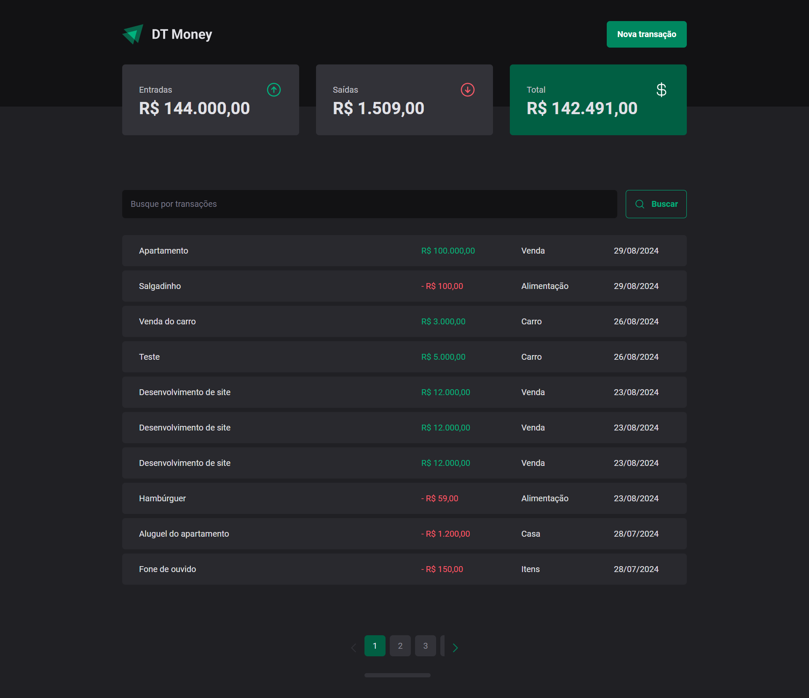
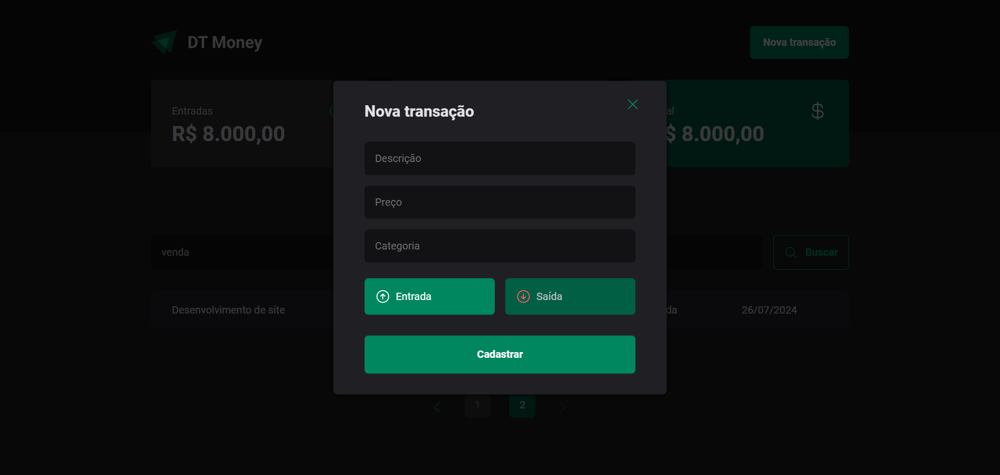

# DT Money

Esse aplicativo foi desenvolvido no curso <a href="https://app.rocketseat.com.br/journey/react-js-2022/overview" target="_blank">ReactJS</a> , foi utilizando React, Vite e TypeScript.

|Lista de transações|Modal de criação de nova transação|
|-------|------|
|||

## 🔨 Funcionalidades do projeto

Esse aplicativo exibe uma lista de entradas e saídas de transações, onde é possível adicionar uma nova transação. 

## ✔️ Técnicas e tecnologias utilizadas

Lista das bibliotecas utilizadas no desenvolvimento:

- `react`
- `react-dom`
- `react-hook-form`
- `vite`
- `typescrip`
- `phosphor-react`
- `date-fns`
- `phosphor-react`
- `styled-components`
- `zod`
- `axios`
- `react-router-dom`
- `json-server`
- `react-query`
- `@radix-ui/react-dialog`
- `@radix-ui/react-radio-group`

## 🛠️ Abrir e rodar o projeto

Dentro da pasta do projeto execute npm i ou yarn para instalar as dependências e npm run dev:server  ou yarn dev:server subir o servidor e npm run dev  ou yarn dev para iniciar o projeto.